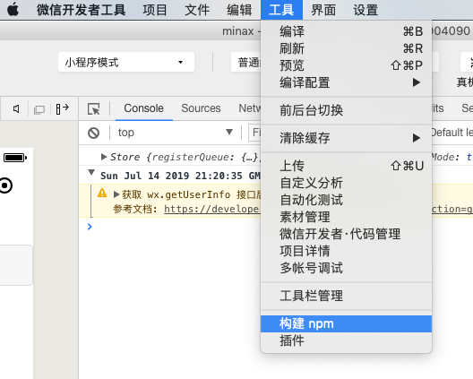
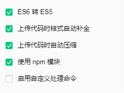

# 安装
> 小程序从基础库2.2.1开始支持npm，[文档链接](https://developers.weixin.qq.com/miniprogram/dev/devtools/npm.html), 使用该插件时建议将您的版本升至2.2.1以上
### 2.2.1以下版本引入方式
针对2.2.1以下基础库版本，请将本库的dist目录复制到您的项目中，然后适用require或者import的方式引用即
```javascript
var Store = require('../dist/index.js') // 具体的路径根据您的文件目录做调整
```
或者
```javascript
import Store from '../dist/index.js' // 具体的路径根据您的文件目录做调整
```
### 2.2.1及以上版本库的引入方式
由于小程序的文件夹默认不采用npm的形式，所以第一步需要将小程序项目初始化成npm项目
```bash
npm init
```
然后根据你的包管理工具使用
```bash
npm install --save minax
```
或者
```bash
yarn add minax
```
安装成功后，点击开发者工具中的菜单栏：工具 --> 构建 npm 

勾选“使用 npm 模块”选项： 

构建完成后即可使用 npm 包,js 中引入 npm 包：
```javascript
const Store = require('minax')
```

# Minax是什么？

